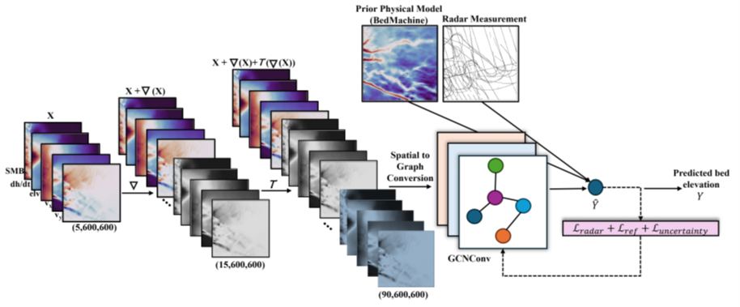
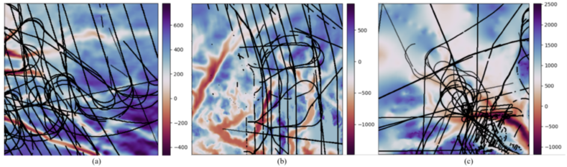

# GraphTopoNet: Graph Learning-Based Bed Topography Estimation with Uncertainty-Aware

<p align="center">
  
</p>

This repository provides a PyTorch-based implementation of **GraphTopoNet**, a graph convolutional network designed for subglacial bed topography prediction using surface-derived features. The model leverages radar data (`data_full.csv`), BedMachine-derived priors (`bed_BedMachine.h5`), and hybrid loss terms to improve bed elevation reconstruction in regions with sparse observational data.

<p align="center">
  
</p>


## 🔧 Input Features

- Multi-modal feature integration: surface velocity, elevation, SMB, and dh/dt
- Gradient and trend surface augmentation to improve spatial modeling
- Hybrid loss combining radar-supervised, BedMachine-regularized, and uncertainty estimation terms
- Patch-based training using radar mask supervision

## 🚀 How to Run

1. Install dependencies:
    ```bash
    pip install torch numpy pandas h5py
    ```
2. Prepare the `data/` folder:
    - Place the following files in `./data/`:
      - `hackathon.h5`
      - `bed_BedMachine.h5`
      - `data_full.csv`
3. Train the model using random sampling:
    ```bash
    python main_train_rs.py
    ```
4. Train the model using spatial slicing:
    ```bash
    python main_train_slicing.py
    ```
Model checkpoints will be saved in `./saved_models/`.

## 📜 Citation
Bayu Adhi Tama, Homayra Alam, Mostafa Cham, Omar Faruque, Jianwu Wang, Vandana Janeja. 
**Improving Greenland bed topography mapping with uncertainty-aware graph learning on sparse radar data**  
arXiv:2509.08571[cs.CV], 2025. [https://doi.org/10.48550/arXiv.2509.08571](https://doi.org/10.48550/arXiv.2509.08571)
(accepted as a Full Paper at Industry & Government Track at **IEEE Big Data 2025**)
